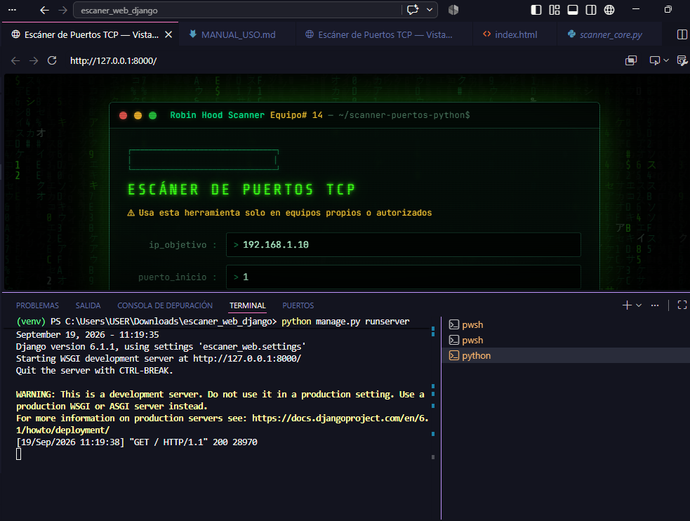

# Manual de Uso --- Escáner de Puertos TCP

**Autor:** Robinson Sarabia\
**Materia:** Seguridad Informática --- Grupo #14\
**Universidad:** Universidad Estatal de Milagro (UNEMI)

**Repositorio:** https://github.com/Robinson33815/scanner-puertos-python

------------------------------------------------------------------------

# 1. Introducción

Este proyecto es un escáner de puertos **TCP** con interfaz web. El
backend está desarrollado en **Python + Django** y utiliza la librería
estándar `socket` mediante el método `connect_ex()` para comprobar qué
puertos aceptan conexiones.

La interfaz web desarrollada con HTML, CSS y JavaScript permite ingresar
una dirección IP autorizada, definir un rango de puertos, visualizar el
avance del análisis, generar un informe de seguridad y guardar los
resultados obtenidos.

# 2. Aviso legal y ético

> Esta herramienta debe utilizarse únicamente en equipos propios,
> máquinas virtuales o laboratorios autorizados.

El escaneo de equipos sin autorización puede representar una actividad
ilegal. Por seguridad, la aplicación solicita confirmar que el equipo
objetivo pertenece al usuario o cuenta con autorización antes de iniciar
el análisis.

# 3. Requisitos

-   Windows, Linux o macOS.
-   Python 3.10 o superior.
-   Git.
-   Navegador web actualizado.

# 4. Instalación

## 4.1 Clonar repositorio

``` bash
git clone https://github.com/Robinson33815/scanner-puertos-python.git
cd scanner-puertos-python
```

## 4.2 Crear entorno virtual

Windows:

``` powershell
python -m venv venv
.\venv\Scripts\Activate.ps1
```

Linux/macOS:

``` bash
python3 -m venv venv
source venv/bin/activate
```

## 4.3 Instalar dependencias

``` bash
pip install -r requirements.txt
```

## 4.4 Ejecutar servidor Django

``` bash
python manage.py runserver
```

Ingresar desde:

    http://127.0.0.1:8000/

## Servidor iniciado



# 5. Uso de la aplicación

## 5.1 Pantalla principal

Al iniciar la aplicación se muestra la interfaz del escáner TCP con los
campos necesarios para realizar el análisis.


Campos:

  Campo           Descripción
  --------------- -----------------------------------------------
  ip_objetivo     Dirección IP del equipo autorizado a analizar
  puerto_inicio   Primer puerto del rango
  puerto_fin      Último puerto del rango

Botones:

  Botón                Función
  -------------------- -----------------------------
  Iniciar Escaneo      Ejecuta el análisis TCP
  Guardar resultados   Exporta el informe generado

# 5.2 Realizar un escaneo

1.  Ingresar la IP del equipo autorizado.
2.  Definir el rango de puertos.
3.  Presionar **Iniciar Escaneo**.
4.  Confirmar la autorización.
5.  Esperar la finalización del análisis.

## Confirmación de autorización


## Escaneo en progreso


Nota: el tiempo depende de la cantidad de puertos evaluados y de la
respuesta del equipo analizado.

# 5.3 Resultados del escaneo

El sistema muestra:

-   Puertos abiertos encontrados.
-   Servicio asociado al puerto.
-   Nivel de riesgo.
-   Resumen del análisis.
-   Informe generado por el analista.


# 5.4 Informe del analista de ciberseguridad

El sistema genera un reporte con:

-   Nivel de exposición.
-   Hallazgos encontrados.
-   Riesgos asociados.
-   Recomendaciones de mitigación.
-   Conclusión técnica.


# 5.5 Guardar resultados

El usuario puede descargar el archivo:

    resultado_escaneo.txt

Este contiene fecha, IP analizada, rango evaluado, puertos encontrados e
informe generado.


# 5.6 Uso por consola

También es posible ejecutar la herramienta mediante consola:

``` bash
python scanner_puertos.py
```

El programa solicita la IP objetivo, rango de puertos y autorización
antes de iniciar.


# 6. Interpretación de resultados

  -----------------------------------------------------------------------
  Nivel                               Significado
  ----------------------------------- -----------------------------------
  ALTO                                Servicios sensibles expuestos que
                                      requieren atención inmediata

  MEDIO                               Servicios que necesitan
                                      configuración segura

  BAJO                                Servicios comunes con riesgo
                                      reducido
  -----------------------------------------------------------------------

# 7. Prueba experimental con Metasploitable

La validación del escáner fue realizada utilizando **Metasploitable**,
una máquina virtual diseñada para prácticas de seguridad informática.

Este entorno permitió realizar pruebas controladas sin afectar equipos
externos, simulando un escenario real de análisis de vulnerabilidades
dentro de un laboratorio autorizado.

Características de la prueba:

  Elemento           Resultado
  ------------------ ---------------------------------------
  Entorno            Laboratorio virtual autorizado
  Equipo analizado   Máquina Metasploitable
  Tipo de análisis   Escaneo TCP
  Objetivo           Validar detección de puertos abiertos


# 8. Limitaciones

-   Solo analiza puertos TCP.
-   No realiza análisis UDP.
-   No identifica versiones reales de servicios.
-   Los riesgos son generados mediante reglas predefinidas.
-   No confirma vulnerabilidades explotables.

Para análisis avanzado se recomienda utilizar herramientas
especializadas como Nmap en entornos autorizados.

# 9. Solución de problemas

  -----------------------------------------------------------------------
  Problema                            Solución
  ----------------------------------- -----------------------------------
  Página en blanco                    Revisar plantilla HTML y actualizar
                                      navegador

  Sin conexión                        Ejecutar nuevamente
                                      `python manage.py runserver`

  Puerto ocupado                      Cambiar puerto con
                                      `python manage.py runserver 8001`

  Error PowerShell                    Ejecutar política RemoteSigned

  Escaneo lento                       Reducir rango de puertos
  -----------------------------------------------------------------------

# 10. Estructura del repositorio

    scanner-puertos-python/

    ├── scanner_puertos.py
    ├── README.md
    ├── MANUAL_USO.md
    ├── manage.py
    ├── requirements.txt
    ├── escaner_web/
    ├── scanner/
    └── capturas/
