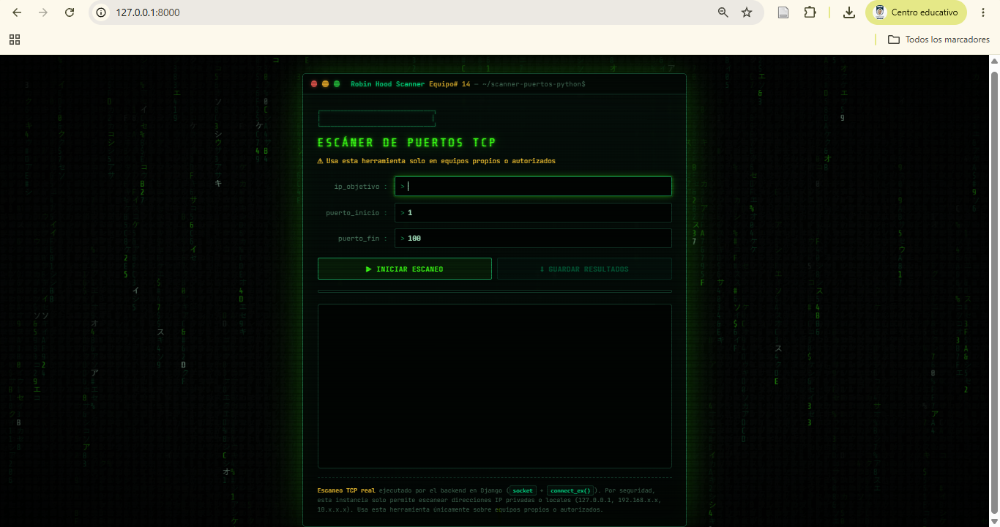

# Escáner de Puertos TCP

Escáner de puertos **TCP** con interfaz web, desarrollado en **Python** y **Django** como proyecto de la materia **Seguridad Informática (Grupo# 14)** de la Universidad Estatal de Milagro (UNEMI).

**Autor:** Robinson Sarabia

> ⚠️ **Uso responsable:** utiliza esta herramienta únicamente en equipos propios, máquinas virtuales o laboratorios autorizados.



## Características

- Escaneo TCP real con `socket` y `connect_ex()`.
- Rango de puertos configurable (1 – 65535).
- Solo permite direcciones IP privadas o locales.
- Confirmación de autorización antes de cada escaneo.
- Nombre del servicio de cada puerto abierto (diccionario de más de 90 puertos).
- Observación de riesgo (ALTO, MEDIO, BAJO) por cada puerto abierto.
- Informe final tipo analista de ciberseguridad, con nivel de exposición, hallazgos y recomendaciones.
- Guardado de resultados en `resultado_escaneo.txt`.
- Interfaz estilo terminal con efecto Matrix.

## Tecnologías

Python · Django · HTML · CSS · JavaScript

## Instalación rápida

```bash
git clone https://github.com/Robinson33815/scanner-puertos-python.git
cd scanner-puertos-python
python -m venv venv
```

Activar el entorno virtual:

```powershell
# Windows (PowerShell)
.\venv\Scripts\Activate.ps1
```

```bash
# Linux / macOS
source venv/bin/activate
```

Instalar dependencias y ejecutar:

```bash
pip install -r requirements.txt
python manage.py runserver
```

Abrir en el navegador: http://127.0.0.1:8000/

## Uso

1. Escribir la IP del equipo a analizar.
2. Indicar el puerto inicial y el final.
3. Pulsar **Iniciar Escaneo** y confirmar que el equipo es propio o autorizado.
4. Revisar el resumen y el informe del analista.
5. Pulsar **Guardar resultados** para descargar el archivo `.txt`.

La guía completa, con capturas de pantalla, está en [MANUAL_USO.md](MANUAL_USO.md).

## Uso por consola (sin Django)

El archivo `scanner_puertos.py` es una versión independiente que funciona en la terminal:

```bash
python scanner_puertos.py
```

Pide la IP y el rango de puertos, valida que la IP sea privada o local, pide confirmar la autorización, muestra los puertos abiertos con el nombre del servicio y permite guardar el resultado en `resultado_escaneo.txt`.

## Prueba realizada

El escáner se validó en un laboratorio virtual autorizado, sobre una máquina **Metasploitable**:

| Elemento | Resultado |
|---|---|
| IP utilizada | 192.168.100.165 |
| Rango de puertos | 1 – 500 |
| Puertos abiertos | 21, 22, 23, 25, 53, 80, 111, 139, 445 |
| Tiempo de ejecución | 245.9 segundos |
| Nivel de exposición | CRÍTICO |

El detalle y las capturas están en [MANUAL_USO.md](MANUAL_USO.md).

## Estructura

```
scanner-puertos-python/
├── scanner_puertos.py    # Lógica de escaneo TCP
├── README.md
├── MANUAL_USO.md
├── manage.py
├── requirements.txt
├── escaner_web/          # Configuración de Django
├── scanner/              # App: vistas, rutas y plantilla HTML
└── capturas/             # Capturas del manual
```

## Limitaciones

- Solo escanea **TCP** (no UDP).
- El nombre del servicio se basa en el número de puerto estándar y no se verifica el programa real ni su versión.
- Las observaciones son orientativas y no confirman vulnerabilidades.

## Licencia y fines

Proyecto con fines **académicos y educativos**.
